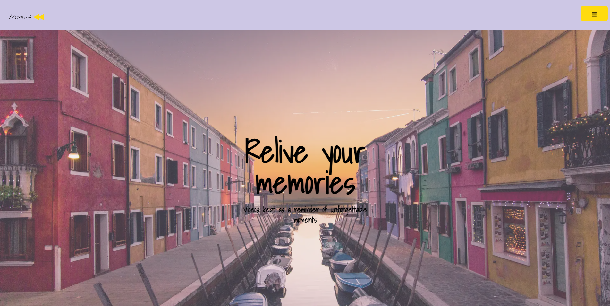
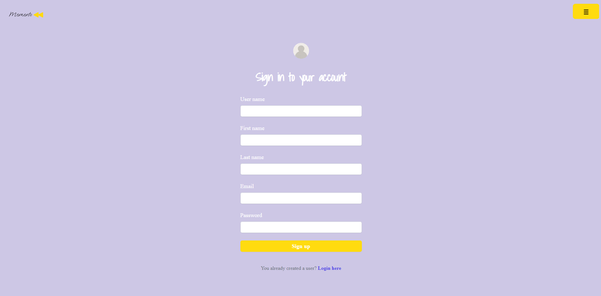
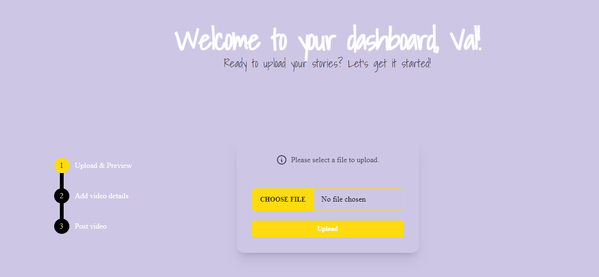
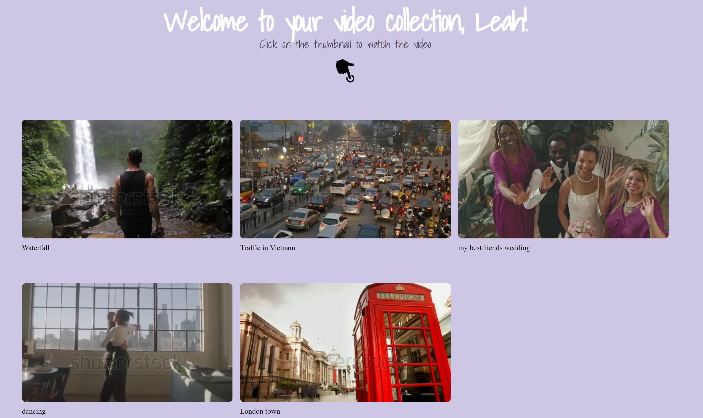
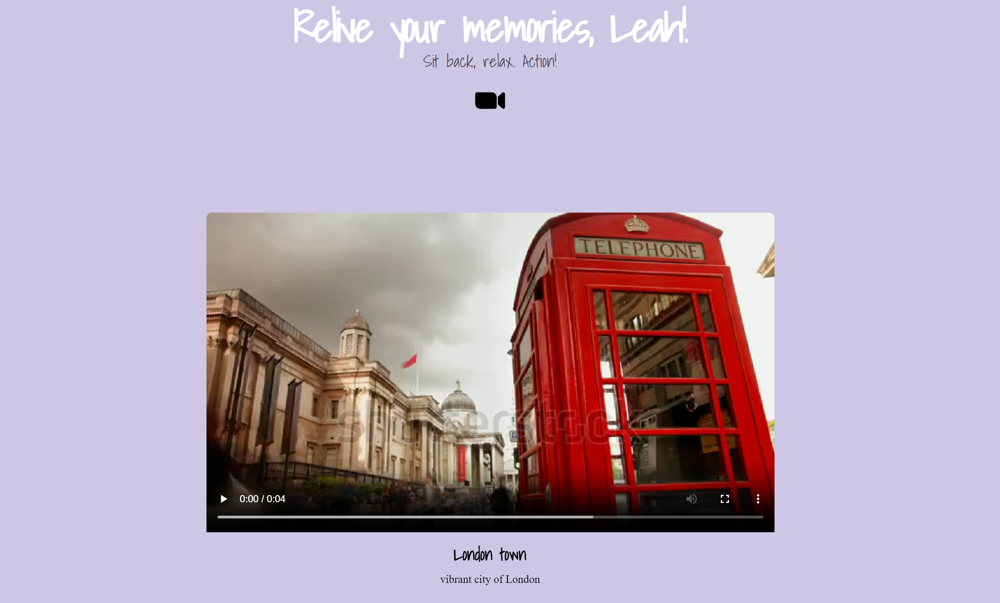

# MEMENTO

## Description

Hello and welcome!

MEMENTO, is full stack web application. A digital video album, enabling users to save videos from different occasions - may it be birthdays, travels, graduations and other types of events in life. The reason why I decided to create memento is since I used to capture my adventures with my GoPro and put together videos as a souvenir, I feel this is a great outlet to collect these memories on a platform and be able to rewatch and relive those mementos, as well as show your friends and relatives. That’s how Memento was born.

Subsequently in order to extend and upgrade the matcha e-commerce-store experience the following features will be added:

- Search bar permitting to browse for specific video categories
- Enable users to like videos and leave comments
- Deletion and edit of video details
- Accessibility features to accomodate a diverse range of users and optimise UX
- Video visibility: set video status to public or private mode

Please take your time and browse through the web application. If you have any feedback or suggestions, please feel free to reach out to me.

Enjoy!

## Technologies used

- Figma
- DrawSQL
- GitHub
- Next.js, React, Node.js
- JavaScript, TypeScript
- HTML, CSS
- PostgreSQL
- Cloudinary REST API
- Tailwind, DaisyUI
- Playwright, Jest
- Fly.io

## Screenshots

This is to give you a glimpse of the application:

